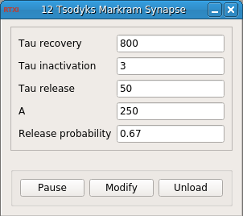

### Tsodyks Markram Synapse

Developed by Rodrigo Amaducci (rodrigo.amaducci@uam.es)

Grupo de Neurocomputación Biológica (GNB), Universidad Autónoma de Madrid

**Requirements:** None  
**Limitations:** None  

<!--start-->

<b>Tsodyks Markram Synapse:</b> synapse model from (Tsodyks and Markram, 1998).

<!--end-->

#### Input
1. input(0) - Vpre (V) : Presynaptic neuron membrane potential

#### Output
1. output(0) - I (nA) : Synaptic current

#### Parameters
1. Tau recovery - Tau recovery parameter
2. Tau inactivation - Tau inactivation parameter
3. Tau release - Tau release parameter
4. A - Absolute synaptic efficacy
5. Release probability - Release probability

#### States

